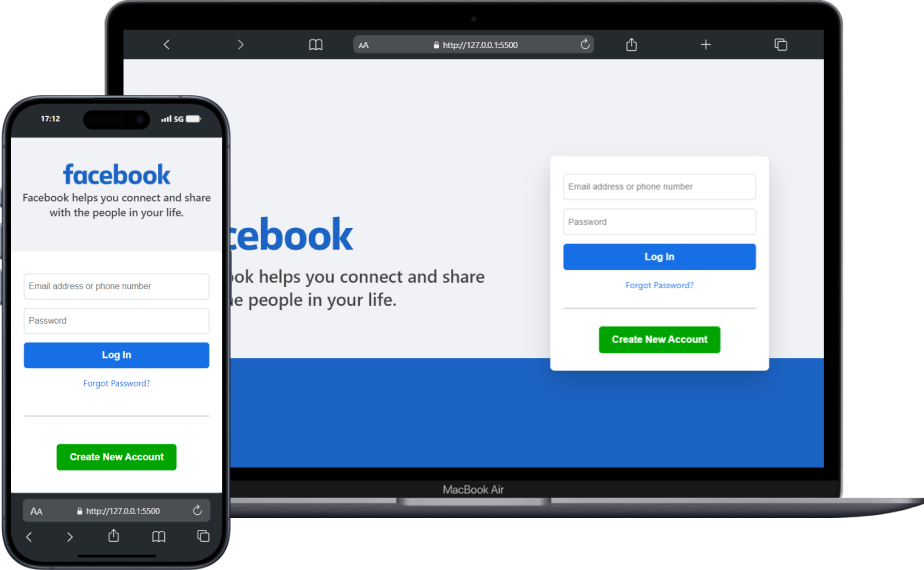
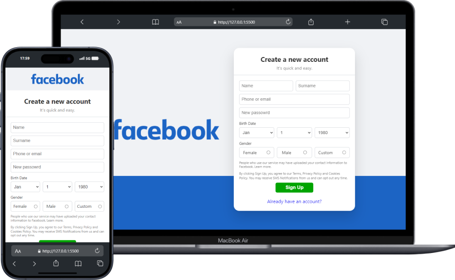
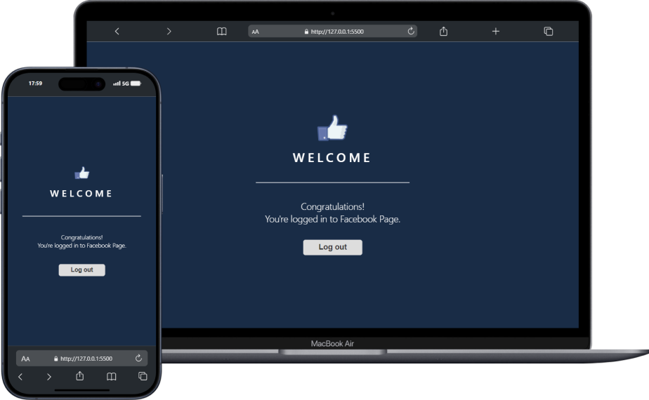

# 👥 Facebook Log In Page
This clone of Facebook Page was made to improve my skills in HTML, CSS and JavaScript. Here, I used the `flexbox` proprieties and `media queries` to make the page responsive. In total, are three different pages that are show according link that was clicked.

### 🚀 Technologies used:

    
    
    

 

### 📷 Preview:

 
 

 
 
